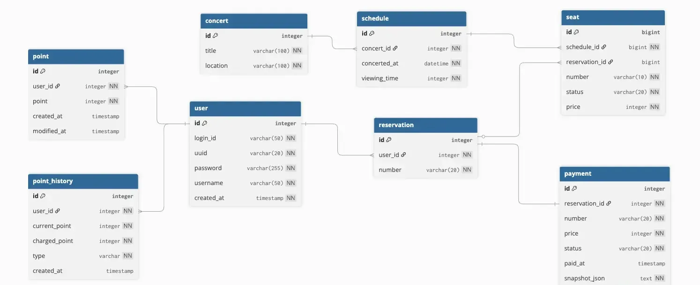

# 콘서트 예약 서비스 ERD

## ERD


`dbdiagram.io`

    ```java
    // 유저 대기열 토큰
    Table token { 
      id integer [primary key, increment]
      uuid varchar [not null] // 사용자 uuid
      number integer [not null] // 대기 순서
    }
    
    Table concert {
      id integer [primary key, increment]
      title varchar(100) [not null]    // 콘서트명
      location varchar(100) [not null] // 콘서트 장소
    
      indexes {
        title // 검색용
      }
    }
    
    Table schedule {
      id integer [primary key, increment]
      concert_id integer [not null]
      concerted_at datetime [not null] // 콘서트 일시
      viewing_time integer [not null] // 관람 시간
    
      indexes {
        (concert_id, concerted_at) // 날짜순 조회 최적화
      }
    }
    
    Table seat {
      id bigint [primary key, increment]
      schedule_id bigint [not null]
      reservation_id bigint // null 허용 (예약 전에는 null)
      number varchar(10) [not null] // 좌석 번호
      status varchar(20) [not null]
      price integer [not null]
    
      indexes {
        (schedule_id, number) [unique] // 중복 좌석 방지 + 조회 최적화
        reservation_id // 내 좌석 조회
      }
    }
    
    Table reservation {
      id integer [primary key, increment]
      user_id integer [not null]
      number varchar(20) [unique, not null] // 예약 번호
    
       indexes {
        user_id // 내 예약 목록 조회
       }
    }
    
    Table payment {
      id integer [primary key, increment]
      reservation_id integer [not null]
      number varchar(20) [unique, not null]
      price integer [not null]
      status varchar(20) [not null] 
      paid_at timestamp
      snapshot_json text [not null]
    
      indexes {
        reservation_id
        number
      }
    }
    
    Table point {
      id integer [primary key, increment]
      user_id integer [not null, unique]
      point integer [not null]
      created_at timestamp
      modified_at timestamp
    
      indexes {
        user_id
      }
    }
    
    Table point_history {
      id integer [primary key, increment]
      user_id integer [not null]
      current_point integer [not null]
      charged_point integer [not null] 
      type varchar [not null]
      created_at timestamp
    
      indexes {
        (user_id, created_at) // 최신 내역 조회 최적화
      }
    }
    
    Table user {
      id integer [primary key, increment]
      login_id varchar(50) [not null, unique]
      uuid varchar(20) [not null, unique]
      password varchar(255) [not null]
      username varchar(50) [not null]
      created_at timestamp [not null]
    
      indexes {
        uuid // 회원 조회용
      }
    }
    
    // 연관관계 설정
    // 1. User와 관련된 관계
    Ref: "user"."id" < "point"."user_id" [delete: cascade] // 회원 삭제 시 포인트 삭제
    Ref: "user"."id" < "point_history"."user_id" // [기본값: Restrict] 내역 있으면 회원 삭제 불가
    Ref: "user"."id" < "reservation"."user_id" // [기본값: Restrict]
    
    // 2. Concert & Schedule 계층 구조
    Ref: "concert"."id" < "schedule"."concert_id" [delete: cascade] // 콘서트 삭제 시 스케줄 삭제
    Ref: "schedule"."id" < "seat"."schedule_id" [delete: cascade] // 스케줄 삭제 시 좌석 삭제
    
    // 3. Reservation 핵심 로직
    Ref: "reservation"."id" - "payment"."reservation_id" // 1:1 관계
    Ref: "reservation"."id" < "seat"."reservation_id" [delete: set null] // [중요] 예약 취소 시 좌석의 연결만 끊음
    ```

**user - point  (1:1 관계)**

- **연관관계 주인**: point (FK: user_id)
- **외래키 제약조건**: ON DELETE CASCADE → 회원 삭제 시 포인트도 삭제

**user - point _history (1:N 관계)**

- **연관관계 주인**: point_history (FK: user_id)

**user - reservation (1:N 관계)**

- **연관관계 주인**: reservation (FK: user_id)

**reservation -  seat (1:N 관계)**

- **연관관계 주인**: seat (FK: reservation_id)
- **외래키 제약조건**: ON DELETE SET NULL → 예약 취소 시 좌석의 연결만 끊음

**reservation -  payment (1:1 관계)**

- **연관관계 주인**: payment (FK: reservation_id)

**schedule - seat (1:N 관계)**

- **연관관계 주인**: seat (FK: schedule_id)
- **외래키 제약조건**: ON DELETE CASCADE → 스케줄 삭제 시 좌석 삭제

**concert - schedule (1:N 관계)**

- **연관관계 주인**: schedule (FK: concert_id)
- **외래키 제약조건**: ON DELETE CASCADE → 콘서트 삭제 시 스케줄 삭제

## 테이블 상세
### User (회원)

| **컬럼 (Column)** | **타입 (Type)** | **제약조건 (Constraints)** | **설명 (Description)** |
| --- | --- | --- | --- |
| **id** | `BIGINT` | **PK**, AUTO_INCREMENT | 내부 관리용 회원 ID (PK) |
| **login_id** | `VARCHAR(50)` | UNIQUE, NOT NULL | 로그인 아이디 |
| **uuid** | `VARCHAR(20)` | UNIQUE, NOT NULL | 회원 고유 식별자 |
| **password** | `VARCHAR(255)` | NOT NULL | 비밀번호 |
| **username** | `VARCHAR(50)` | NOT NULL | 사용자 실명 |
| **created_at** | `DATETIME` | NOT NULL | 가입 일시 |

**인덱스**

- uuid: 회원 고유 식별자로 회원 조회

### Concert (콘서트)

| **컬럼 (Column)** | **타입 (Type)** | **제약조건 (Constraints)** | **설명 (Description)** |
| --- | --- | --- | --- |
| **id** | `BIGINT`  | **PK**, AUTO_INCREMENT | 콘서트 ID |
| **title** | `VARCHAR(100)` | NOT NULL | 콘서트 제목 |
| **location** | `VARCHAR(100)` | NOT NULL | 공연 장소 |

**인덱스**

- title: 콘서트 제목으로 콘서트 조회

### Schedule (콘서트 스케줄)

| **컬럼 (Column)** | **타입 (Type)** | **제약조건 (Constraints)** | **설명 (Description)** |
| --- | --- | --- | --- |
| **id** | `BIGINT` | **PK**, AUTO_INCREMENT | 스케줄 ID |
| **concert_id** | `BIGINT` | **FK**, NOT NULL | 콘서트 ID |
| **concerted_at** | `DATETIME` | NOT NULL | 공연 일시 |
| **viewing_time** | `INTEGER` | NOT NULL | 관람 시간 |

**인덱스**

- (concert_id, concerted_at): 콘서트별 스케줄 날짜순 조회

### Seat (좌석)
| **컬럼 (Column)** | **타입 (Type)** | **제약조건 (Constraints)** | **설명 (Description)**                                                                            |
| --- | --- | --- |-------------------------------------------------------------------------------------------------|
| id | BIGINT | PK, AUTO_INCREMENT | 좌석 ID                                                                                           |
| schedule_id | BIGINT | FK, NOT NULL | 스케줄 ID                                                                                          |
| reservation_id | BIGINT | FK | 예약 ID (NULL 가능)                                                                                 |
| number | VARCHAR(10) | NOT NULL | 좌석 번호                                                                                           |
| status | VARCHAR(20) | NOT NULL | 좌석 상태  <br> • AVAILABLE: 예약 가능  <br> • HOLD: 예약 보류  <br> • RESERVED: 예약 완료  <br> • CANCELED: 취소 |
| price | INTEGER | NOT NULL | 좌석 가격                                                                                           |

**인덱스**

- (schedule_id, number): 회차별 좌석 조회
- reservation_id: 예약된 좌석 조회

### Reservation (예약)

| **컬럼 (Column)** | **타입 (Type)** | **제약조건 (Constraints)** | **설명 (Description)** |
| --- | --- | --- | --- |
| **id** | `BIGINT` | **PK**, AUTO_INCREMENT | 예약 ID |
| **user_id** | `BIGINT`  | **FK**, NOT NULL | 회원 ID |
| **number** | `VARCHAR(20)` | UNIQUE, NOT NULL | 예약 번호 |

**인덱스**

- user_id: 내 예약 목록 조회

### Payment (결제)
| **컬럼 (Column)** | **타입 (Type)** | **제약조건 (Constraints)** | **설명 (Description)**                                                        |
| --- | --- | --- |-----------------------------------------------------------------------------|
| **id** | `BIGINT` | **PK**, AUTO_INCREMENT | 결제 ID                                                                       |
| **reservation_id** | `BIGINT` | **FK**, NOT NULL | 예약 ID                                                                       |
| **number** | `VARCHAR(20)` | UNIQUE, NOT NULL | 결제 번호 <br> • 형식: pt_{uid} <br> • example: pt_202411130001                   |
| **price** | `INTEGER` | NOT NULL | 결제 금액                                                                       |
| **status** | `VARCHAR(20)` | NOT NULL | 결제 상태 <br> • PAID: 결제 완료 및 확정 <br> • CANCELED: 결제 취소 또는 환불 완료               |
| **snapshot_json** | `TEXT` | NOT NULL | 결제 시점의 정보를 담은 JSON 데이터 <br> • 회원 이름, 콘서트명, 콘서트 장소, 콘서트 시간, 관람 시간, 좌석 번호 리스트 |
| **paid_at** | `TIMESTAMP` |  | 결제일                                                                         |

**인덱스**

- reservation_id: 예약 id로 결제 조회
- number: 결제 번호로 결제 조회

### Point (포인트)

| **컬럼 (Column)** | **타입 (Type)** | **제약조건 (Constraints)** | **설명 (Description)** |
| --- | --- | --- | --- |
| **id** | `BIGINT` | **PK**, AUTO_INCREMENT | 포인트 ID |
| **user_id** | `BIGINT` | **FK**, NOT NULL, UNIQUE | 회원 ID |
| **point** | `INTEGER` | NOT NULL | 보유 포인트 |
| **created_at** | `TIMESTAMP` |  | 생성일 |
| **modified_at** | `TIMESTAMP` |  | 변경일 |

**인덱스**

- user_id: 특정 회원의 포인트 조회

### PointHistory (포인트 내역)

| **컬럼 (Column)** | **타입 (Type)** | **제약조건 (Constraints)** | **설명 (Description)**     |
| --- | --- | --- |--------------------------|
| **id** | `BIGINT` | **PK**, AUTO_INCREMENT | 포인트 내역 ID                |
| **user_id** | `BIGINT` | **FK**, NOT NULL | 회원 ID                    |
| **current_point** | `INTEGER` | NOT NULL | 현재 포인트                   |
| **charged_point** | `INTEGER`  | NOT NULL | 충전된 포인트                  |
| **type** | `VARCHAR` | NOT NULL | 포인트 내역 타입 <br> • 충전 / 사용 |
| **created_at** | `TIMESTAMP` |  | 생성일                      |

**인덱스**

- (user_id, created_at): 특정 회원의 포인트 내역 최신순 조회