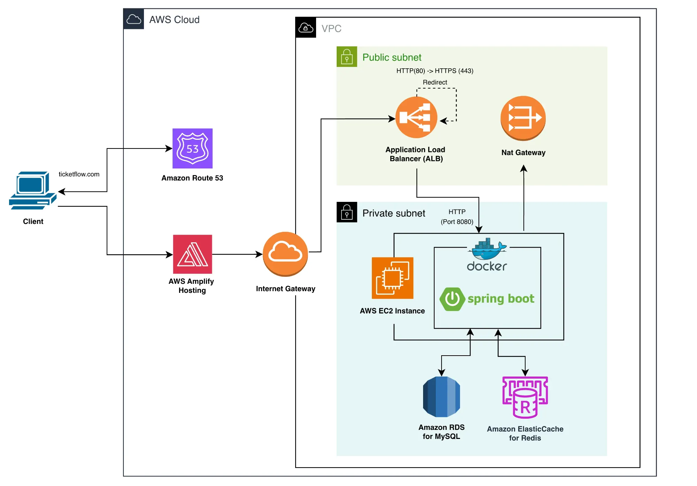

# 인프라 구성도

### 요청 흐름

**[1] 정적 페이지 요청**

- DNS 질의 (Route 53): 사용자의 브라우저가 `ticketflow.com` 주소를 찾기 위해 DNS 서버에 질의
- 프론트엔드 접속 (AWS Amplify): 사용자의 브라우저가 Amplify에서 정적 페이지 렌더링

**[2] 백엔드 API 요청**

**진입**

- 브라우저가 API 서버로 요청 → Internet Gateway 통과

**HTTPS 처리 (Public Subent)**

- ALB로 트래픽 도달 → HTTP (80) 포트일 경우 HTTPS (443)으로 리다이렉트
- SSL/TLS 인증서 검증 후, 암호화된 패킷 처리
- Private Subnet의 EC2 인스턴스로 요청 전달

**비즈니스 로직 처리 (Private Subnet - App Layer)**

- EC2 내부의 Docker 컨테이너로 요청 전달
- Spring Boot 내장 톰캣 8080 포트로 요청 받음

**데이터 조회 및 저장 (Private Subnet - Data Layer)**

- 비즈니스 로직에 따라 데이터베이스 또는 캐시 호출

### 구성 요소 및 역할

**[1] 네트워크 및 인프라**

**VPC (Virtual Private Cloud)**

- AWS 내의 가상 격리 네트워크

**Internet Gateway**

- VPC의 진입점
- VPC 내부와 외부 인터넷 간의 통신을 가능하게 함

**Public Subnet**

- 외부 인터넷과 직접 통신이 가능
- ALB, NAT Gateway 배치

**Private Subnet**

- 외부 인터넷에서 접근 불가
- EC2 서버, 데이터베이스를 배치하여 외부 공격으로부터 보호

**NAT Gateway**

- Private Subnet에 있는 EC2 서버가 외부 인터넷을 사용해야 할 때 나가는 통로

**[2] 트래픽 관리 및 프론트엔드**

**Amazon Route 53**

- DNS: 도메인 주소를 IP 주소로 변환하여 사용자를 올바른 목적지로 안내 (Amplify 또는 ALB)

**AWS Amplify Hosting**

- 프론트엔드 호스팅: 정적 웹 사이트 배포 및 관리

**ALB(Application Load Balancer)**

- 외부에서 들어온 요청을 Private Subnet의 Spring Boot 인스턴스로 전달
- HTTP(80) 요청을 HTTPS(443)으로 리다이렉트, SSL 인증서 처리

**[3] 애플리케이션 계층**

**AWS EC2 Instance**

- 컴퓨팅 자원을 제공하는 가상 컴퓨터

**Docker**

- EC2 내부에서 애플리케이션을 실행하는 환경

**Spring Boot**

- 백엔드 프레임워크
- 사용자의 요청을 처리하는 애플리케이션 (REST API 제공)

**[4] 데이터 계층**

**Amazon RDS for MySQL**

- 관계형 데이터베이스
- 회원 정보, 주문 내역 등 서비스의 핵심 데이터를 영구적으로 저장

**Amazon ElasticCache for Redis**

- 인메모리 데이터 저장소
- 캐싱: 자주 조회되는 데이터(ex: 인기 공연 목록)를 저장하여 DB 부하를 줄이고 응답 속도 향상
- 세션 저장: 로그인 세션 정보 저장